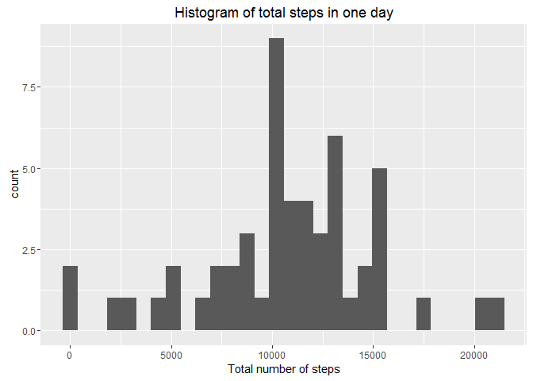

# Reproducible Research: Peer Assessment 1

## Loading and preprocessing the data


```r
library(ggplot2)
library(plyr)
activity <- read.csv("activity.csv")
activity$date <- as.Date(as.character(activity$date), "%Y-%m-%d")
```

## What is mean total number of steps taken per day?

1. Calculating the total number of steps taken per day


```r
Daysteps <- aggregate(activity$steps, list(activity$date), sum)
names(Daysteps) <- c("date","steps")
```

2. Histogram to show the total number of steps taken per day


```r
ggplot(Daysteps,aes(x=steps))+geom_histogram()+
  xlab("Total number of steps")+
  ggtitle("Histogram of total steps in one day")
```

<!-- -->

3. Mean and median of the total number of steps taken per day


```r
mean(Daysteps$steps, na.rm = TRUE)
```

```
## [1] 10766.19
```

```r
median(Daysteps$steps, na.rm = TRUE)
```

```
## [1] 10765
```

## What is the average daily activity pattern?


```r
timeactivity <- activity
timeactivity[is.na(timeactivity)] <- 0 
timemean <- aggregate(timeactivity$steps, list(timeactivity$interval), mean)
names(timemean) <- c("interval","steps")
plot(timemean$interval, timemean$steps, type = "l")
```

<!-- -->

5-minute interval, on average across all the days in the dataset, contains the maximum number of steps


```r
timemean[timemean$steps==max(timemean$steps), 1]
```

```
## [1] 835
```

## Imputing missing values

1. Calculate and report the total number of missing values in the dataset


```r
sum(is.na(activity$steps))
```

```
## [1] 2304
```

2. strategy for filling in all of the missing values in the dataset
3. Create a new dataset that is equal to the original dataset but with the missing data filled in


```r
mergeddata <- merge(activity, timemean, by = c("interval"))
for(i in 1 : nrow(mergeddata)){
  if (is.na(mergeddata[i,2])) {
    mergeddata[i,2] <- mergeddata[i,4]
  }
}
mergeddata$steps.y <- NULL
```

4. Histogram of the total number of steps taken each day


```r
mergedsteps <- aggregate(mergeddata$steps.x, list(mergeddata$date), sum)
names(mergedsteps) <- c("date","steps")
ggplot(mergedsteps,aes(x=steps))+geom_histogram()+
  ggtitle("Average steps for each 5-min interval")+
  ylab("Mean steps")
```

<!-- -->

5. Calculate and report the mean and median total number of steps taken per day


```r
mean(mergedsteps$steps)
```

```
## [1] 10581.01
```

```r
median(mergedsteps$steps)
```

```
## [1] 10395
```

Conclusion : Imputing missing values have reduced the mean and it is now more accurate

## Are there differences in activity patterns between weekdays and weekends?

1. New factor variable in the dataset with two levels - "weekday" and "weekend"


```r
weekdayslist = c("Monday","Tuesday","Wednesday","Thursday","Friday")
mergeddata$weekday<-as.factor(ifelse(weekdays(mergeddata$date)%in%weekdayslist,"weekday","weekend"))
weekdaysplit<-ddply(mergeddata, c("interval","weekday"),summarise, meansteps = mean(steps.x,na.rm=TRUE))
```

2. Time series plot of the 5-minute interval (x-axis) and the average number of steps 


```r
ggplot(weekdaysplit,aes(x=interval,y=log10(meansteps)))+
  facet_wrap(~weekday,nrow=2,ncol=1)+
  geom_line()+
  theme_bw()+
  ylab("Number of steps")+
  xlab("Interval")
```

<!-- -->


  
